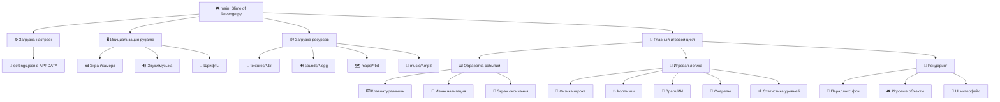
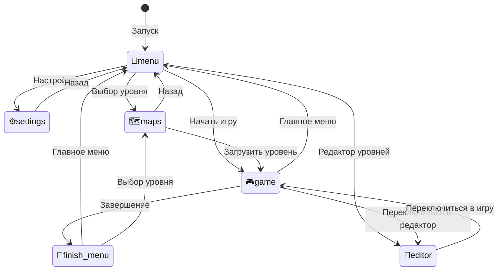

# 🎮 Slime of Revenge
<p align="center">
  
</p>

## Документация проекта

> **2D платформер на Python с настраиваемым управлением и редактором контента**

---

### 👨‍💻 **Автор**
[](https://github.com/Perforator321) **[Дарий](https://github.com/Perforator321)**

### 🤝 **Помощник**
[](https://github.com/FitoDomik) **[Легенда](https://github.com/FitoDomik)**

### 📝 **Описание**
**Slime of Revenge** — это 2D платформер, разработанный на Python с использованием библиотеки pygame. Игра включает в себя настраиваемое управление, встроенный редактор контента и гибкую систему уровней.

---

## 📁 Структура проекта

```
🎮 Slime of Revenge/
│
├── 📚 Документация
│   └── 📘 README.md                         # Этот файл
│
├── 🎯 Исполняемые файлы
│   ├── 🐍 Slime of Revenge.py               # 🔥 Основной файл запуска
│   └── 🎨 draw.py                           # ✨ Редактор текстур
│
├── 🗺️ Уровни (maps/)
│   ├── 📄 OnlyUp.txt                        # Вертикальный челлендж
│   ├── 📄 Ascent.txt                        # Восхождение
│   ├── 📄 DOOM.txt                          # Уровень в стиле DOOM
│   ├── 📄 Going down.txt                    # Спуск
│   ├── 📄 Feel a little pain.txt            # Испытание боли
│   ├── 📄 They all.txt                      # Все они
│   ├── 📄 Torn by katana.txt                # Разорван катаной
│   ├── 📄 Too easy.txt                      # Слишком легко
│   ├── 📄 Архангельск.txt                   # Русский уровень
│   ├── 📄 Изподподтешка.txt                 # Русский уровень
│   └── 📄 aTest.txt                         # Тестовый уровень
│
├── 🎭 Ресурсы
│   ├── 🧩 textures/                         # Текстуры и анимации
│   │   ├── 👤 Персонаж
│   │   │   ├── GGStop.txt, GGRun.txt        # Стойка и бег
│   │   │   ├── GGJump.txt, GGJumpRun.txt    # Прыжки
│   │   │   └── GGDash.txt, GGDashRun.txt    # Рывки
│   │   ├── 👹 Враги
│   │   │   ├── enemyFly.txt                 # Летающий враг
│   │   │   ├── enemyFlyStan.txt             # Станированный враг
│   │   │   └── dieEnemyFly.txt              # Смерть врага
│   │   ├── 🔫 Оружие
│   │   │   ├── Gun.txt, Gun2.txt            # Пистолеты
│   │   │   ├── Bullets.txt, BulletsMax.txt   # Патроны
│   │   │   └── BulletTexture.txt            # Текстура пули
│   │   ├── ✨ Эффекты
│   │   │   ├── RollBack.txt, RollBack2.txt  # Откат
│   │   │   └── SpawnAnime.txt, SpawnAnime2.txt # Спавн
│   │   ├── 🏗️ Объекты
│   │   │   ├── Spikes.txt                   # Шипы
│   │   │   └── Finish.txt                   # Финиш
│   │   ├── 🌌 Фон
│   │   │   ├── Background1.txt, Background2.txt # Фоны
│   │   │   ├── PlanetBackground.txt         # Планета
│   │   │   ├── bigStar.txt, smallStar.txt   # Звезды
│   │   │   └── shootingStarBig.txt          # Падающие звезды
│   │   ├── 🎵 Музыка
│   │   │   ├── Cassette.txt, CassetteEmpty.txt # Кассеты
│   │   │   └── Plate.txt                    # Пластинка
│   │   └── 🔤 Шрифты
│   │       └── Faithful.ttf                 # Основной шрифт
│   │
│   ├── 🔊 sounds/                           # Звуковые файлы
│   │   ├── 🎯 Действия игрока
│   │   │   ├── Run.ogg, jump.ogg, dash.ogg  # Движение
│   │   │   ├── Shoot.ogg, misfire.ogg       # Стрельба
│   │   │   └── die.ogg, Rollback.ogg        # Смерть и откат
│   │   ├── 🎮 Интерфейс
│   │   │   ├── click.ogg, scroll.ogg        # UI звуки
│   │   │   └── save.ogg                     # Сохранение
│   │   ├── 👹 Враги
│   │   │   ├── StartEnemy.ogg, StoptEnemy.ogg # AI состояния
│   │   │   └── dieEnemy.ogg                 # Смерть врага
│   │   ├── 🌍 Окружение
│   │   │   ├── hitWall.ogg, hitEnem.ogg     # Столкновения
│   │   │   ├── drop.ogg, charger.ogg        # Объекты
│   │   │   └── Finish.ogg                   # Завершение уровня
│   │   └── 🎵 Музыка
│   │       └── Roundabout.mp3               # Фоновая музыка
│   │
│   ├── 🎵 music/                            # Музыкальные треки
│   │   ├── Roundabout.mp3                   # Основная тема
│   │   ├── All Star.mp3                     # All Star
│   │   ├── Bring Me To Life.mp3             # Bring Me To Life
│   │   ├── Monster.mp3                      # Monster
│   │   ├── It's Going Down Now.mp3          # It's Going Down Now
│   │   ├── The Only Thing I Know For Real.mp3 # The Only Thing I Know For Real
│   │   └── The Only Thing They Fear Is You.mp3 # The Only Thing They Fear Is You
│   │
│   └── 🎨 textures658/                      # Дополнительные текстуры
│       └── FinishArm.txt                    # Рука финиша
```

---

## 🔧 Описание компонентов

### 🎮 **Основные исполняемые файлы**

#### 🚀 `Slime of Revenge.py`
> **Главный файл игры** — основная точка входа

**Функциональность:**
- 🎯 Главный игровой цикл и обработка событий
- ⚡ Физическая система и коллизии
- 🎨 Рендеринг и графический движок
- 🔊 Звуковая система
- 📱 Система меню и навигации
- ⚙️ Управление настройками
- 🗺️ Встроенный редактор уровней

**Ключевые функции:**
| Функция | Назначение |
|---------|------------|
| `load_settings()` | Загрузка пользовательских настроек |
| `save_settings()` | Сохранение конфигурации |
| `init_keys()` | Инициализация управления |
| `update_sound_volumes()` | Применение громкости звука |
| `start_level_timer()` | Запуск таймера уровня |
| `napravl()` | Обработка направления рывка |
| `drawingTextures()` | Рендеринг текстур из текстового формата |
| `appStars()` | Генерация звездного фона |

#### 🎨 `draw.py` — Редактор текстур
**Возможности:**
- 🎭 Создание и редактирование анимаций
- 🎨 Продвинутая палитра цветов
- ⏱️ Временная шкала (таймлайн)
- 🖌️ Профессиональные инструменты рисования
- 💾 Сохранение в текстовом формате

---

### ⚙️ **Система конфигурации**

#### `settings.json` — Файл настроек
```json
{
  "keys": {
    "UP": 119,           // Клавиша вверх (W)
    "DOWN": 115,         // Клавиша вниз (S)
    "LEFT": 97,          // Клавиша влево (A)
    "RIGHT": 100,        // Клавиша вправо (D)
    "JUMP": 32,          // Клавиша прыжка (Space)
    "DASH": 304,         // Рывок (LSHIFT)
    "SHOOT": "MOUSE_1"   // Стрельба (ЛКМ)
  },
  "sound": {
    "music_volume": 15,
    "sfx_volume": 100,
    "musicTheme": "Roundabout.mp3"
  },
  "display": {
    "show_fps": true,
    "parallax_background": true,
    "background_type": "night"
  },
  "statistics": {
    "level_times": {},
    "level_deaths": {},
    "current_level_start_time": 0,
    "current_level_pause_on": 0,
    "current_level_deaths": 0,
    "current_level_name": ""
  }
}
```

---

### 🗺️ **Система уровней**

#### Формат карт `maps/*.txt`
Уровни хранятся как Python-структуры, доступные через `ast.literal_eval()`:

```python
{
    "blocks": [[x, y, width, height, color], ...],      # Платформы
    "spikes": [[x, y, width, height], ...],             # Опасности
    "enemies": [[x, y, type, parameters], ...],         # Противники
    "spawnpoint": [x, y],                               # Точка старта
    "finish": [x, y, width, height],                    # Финиш
    "background": {"type": "parallax", "elements": [...]} # Фон
}
```

**Доступные уровни:**
- 🎓 **aTest.txt** — Тестовый уровень
- ⬆️ **OnlyUp.txt** — Вертикальный челлендж на скорость
- 🏔️ **Ascent.txt** — Восхождение
- 🔥 **DOOM.txt** — Уровень в стиле DOOM
- ⬇️ **Going down.txt** — Спуск
- 💀 **Feel a little pain.txt** — Испытание боли
- 👥 **They all.txt** — Все они
- ⚔️ **Torn by katana.txt** — Разорван катаной
- 😴 **Too easy.txt** — Слишком легко
- 🇷🇺 **Архангельск.txt** — Русский уровень
- 🇷🇺 **Изподподтешка.txt** — Русский уровень

---

### 🎭 **Система ресурсов**

#### 🧩 Текстуры `textures/*.txt`
Покадровые анимации в формате: `[x_coords[], y_coords[], colors[]]`

**Категории текстур:**
- 👤 **Персонаж:** Stop, Run, Jump, JumpRun, Dash, DashRun
- 👹 **Враги:** enemyFly, enemyFlyStan, dieEnemyFly
- 🔫 **Оружие:** Gun, Gun2, Bullets, BulletsMax, BulletTexture
- ✨ **Эффекты:** RollBack, SpawnAnime, Spikes, Finish
- 🌌 **Фон:** Background1, Background2, PlanetBackground, bigStar, smallStar
- 🎵 **Музыка:** Cassette, CassetteEmpty, Plate

#### 🔊 Аудио `sounds/` и `music/`
Поддерживаемые форматы: **OGG**, **MP3**

---

## 🏗️ Архитектура системы

### 📊 **Поток данных**



### 🔄 **Состояния игры**



---

## 📚 Технический стек

### 🐍 **Основные библиотеки**

| Библиотека | Версия | Назначение | Использование |
|-----------|--------|------------|---------------|
| **pygame** | Latest | Игровой движок | Окно, события, рендеринг, звук |
| **PIL/Pillow** | Latest | Обработка изображений | Создание текстур из координат |
| **math** | Built-in | Математика | Физика, тригонометрия |
| **ast** | Built-in | Парсинг | Загрузка текстур и карт |
| **json** | Built-in | Сериализация | Настройки и статистика |
| **os** | Built-in | Файловая система | Работа с путями |
| **win32api** | Windows | Системная информация | Разрешение экрана |

### ⚡ **Дополнительные модули**

- **enum** — Структурирование констант
- **random** — Генерация звёздного фона
- **io** — Работа с байтовыми потоками для текстур

---

## 🚀 Запуск и установка

### 📋 **Требования**
- **Python 3.8+**
- **pygame 2.0+**
- **Pillow (PIL)**
- **Windows** (для полноэкранного режима)

### 🎯 **Быстрый старт**

```bash
# Клонирование проекта
git clone [repository_url]
cd "Slime of Revenge"

# Установка зависимостей
pip install pygame pillow

# Запуск основной игры
python "Slime of Revenge.py"

# Запуск редактора текстур
python "draw.py"
```

### ⚙️ **Последовательность инициализации**

1. 📦 **Импорты и шрифты** — `pygame.font.init()`
2. ⚙️ **Загрузка настроек** — `settings.json` в APPDATA или значения по умолчанию
3. 🖥️ **Инициализация** — `pygame.mixer.pre_init()`, `pygame.init()`
4. 📐 **Настройка экрана** — полноэкранный режим, масштабирование
5. 📦 **Ресурсы** — загрузка звуков и текстур
6. 🌌 **Фон** — инициализация параллакс-системы
7. 🔄 **Главный цикл** — переход к состоянию меню

---

## 🎨 Уникальные особенности

### ✨ **Инновационные решения**

#### 📝 **Текстовый формат ресурсов**
- **Преимущества:** простота редактирования, совместимость с редактором
- **Применение:** текстуры и карты в читаемом формате
- **Гибкость:** легкая модификация без специальных инструментов

#### 💥 **Кастомная физика**
- **Подход:** прямые проверки прямоугольников
- **Контроль:** полная кастомизация поведения
- **Производительность:** оптимизировано для 2D платформера

#### 🌌 **Процедурный параллакс**
- **Генерация:** звёзды и луна создаются алгоритмически
- **Эффективность:** минимальное потребление ресурсов
- **Красота:** динамический звёздный фон

#### ⚡ **Автосохранение настроек**
- **Мгновенность:** применение изменений в реальном времени
- **Персистентность:** сохранение биндов и громкости
- **Удобство:** не требует ручного сохранения

#### 🎨 **Встроенный редактор уровней**
- **Режим создания:** переключение между игрой и редактором
- **Инструменты:** создание блоков, врагов, финиша
- **Сохранение:** автоматическое сохранение в текстовом формате

### 🎯 **Преимущества архитектуры**

| Особенность | Преимущество |
|-------------|--------------|
| 🏗️ **Монолитность** | Простота разработки и отладки |
| 🔧 **Прозрачность ресурсов** | Легкая модификация без сложных инструментов |
| ⚡ **Быстрые итерации** | Мгновенное тестирование изменений |
| 📚 **Низкий порог входа** | Понятная структура для новичков |
| 🎨 **Встроенный редактор** | Создание контента без внешних инструментов |

---

## 🎓 Для разработчиков

### 🔧 **Кастомизация**

#### Добавление нового уровня:
1. Создайте файл `maps/your_level.txt`
2. Определите структуру уровня в Python-формате
3. Добавьте спавн-точку и финиш
4. Уровень автоматически появится в списке

#### Создание новой анимации:
1. Запустите `draw.py`
2. Нарисуйте кадры анимации
3. Сохраните в `textures/your_animation.txt`
4. Подключите в основном коде игры

#### Настройка управления:
1. Откройте меню настроек в игре
2. Переназначьте клавиши через интерфейс
3. Изменения сохраняются автоматически

### 🐛 **Отладка**

- Используйте встроенный режим редактора (G) для отладки уровней
- Проверяйте `settings.json` в APPDATA при проблемах с настройками
- Звуковые файлы должны быть в формате OGG/MP3

### 🔄 **Обновления**
Проект активно развивается. Следите за изменениями в архитектуре и новыми возможностями редактора.

---

## 🎉 Заключение

**Slime of Revenge** представляет собой полнофункциональный 2D платформер, созданный с акцентом на простоту использования и гибкость кастомизации. Проект идеально подходит как для изучения разработки игр на Python, так и для создания собственного игрового контента.

**Ключевые достоинства:**
- 🎮 Полноценный игровой процесс
- 🎨 Встроенные инструменты создания контента
- ⚙️ Гибкая система настроек
- 📚 Понятная архитектура для обучения
- 🔧 Простота модификации и расширения
- 🌌 Красивая параллакс-графика