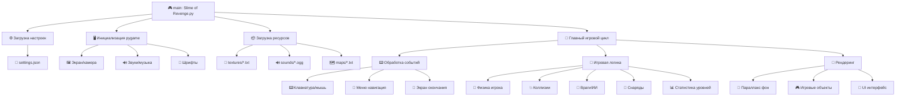
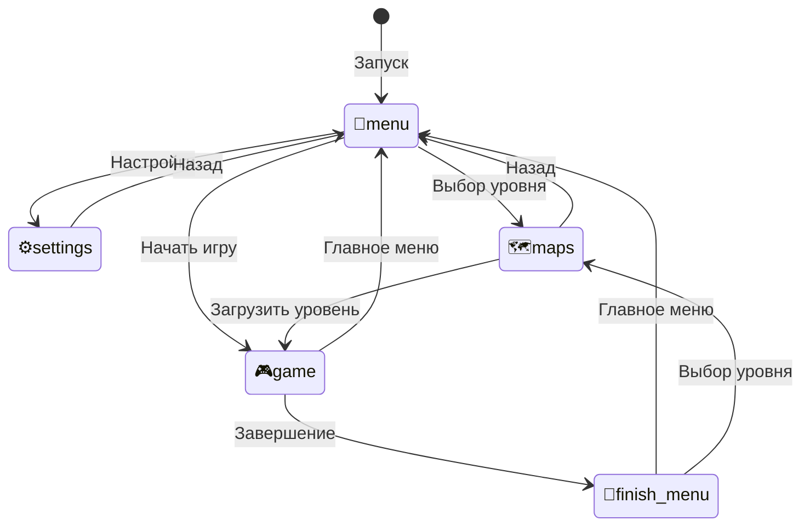

# 🎮 Slime of Revenge
<p align="center">
  
</p>

## Документация проекта

> **2D платформер на Python с настраиваемым управлением и редактором контента**

---

### 👨‍💻 **Автор**
[](https://github.com/Perforator321) **[Дарий](https://github.com/Perforator321)**

### 🤝 **Помощник**
[](https://github.com/FitoDomik) **[Легенда](https://github.com/FitoDomik)**

### 📝 **Описание**
**Slime of Revenge** — это 2D платформер, разработанный на Python с использованием библиотеки pygame. Игра включает в себя настраиваемое управление, встроенный редактор контента и гибкую систему уровней.

---

## 📁 Структура проекта

```
🎮 Slime of Revenge/
│
├── 📚 Документация
│   └── 📘 README.md                         # Этот файл
│
├── ⚙️ Конфигурация
│   └── ⚙️ settings.json                     # Настройки игры (автогенерация)
│
├── 🎯 Исполняемые файлы
│   ├── 🐍 Slime of Revenge.py               # 🔥 Основной файл запуска
│   └── 🐍 Slime of Revenge & comments.py    # 📝 Версия с комментариями
│
├── 🎨 Редакторы
│   ├── 🎨 draw_new.py                       # ✨ Новый редактор текстур
│   └── 🎨 draw_old.py                       # 📦 Старая версия редактора
│
├── 🗺️ Уровни
│   ├── 📄 0nlyUp.txt                        # Вертикальный челлендж
│   └── 📄 Tutorial.txt                      # Обучающий уровень
│
├── 🎭 Ресурсы
│   ├── 🧩 textures/                         # Текстуры и анимации
│   │   ├── 👤 Персонаж
│   │   │   ├── GGStop.txt, GGRun.txt        # Стойка и бег
│   │   │   ├── GGJump.txt, GGJumpRun.txt    # Прыжки
│   │   │   └── GGDash.txt, GGDashRun.txt    # Рывки
│   │   ├── 👹 Враги
│   │   │   ├── enemyFly.txt                 # Летающий враг
│   │   │   ├── enemyFlyStan.txt             # Станированный враг
│   │   │   └── dieEnemyFly.txt              # Смерть врага
│   │   ├── 🔫 Оружие
│   │   │   ├── Gun.txt, Gun2.txt            # Пистолеты
│   │   │   ├── Bullets.txt, BulletsMax.txt   # Патроны
│   │   │   └── BulletTexture.txt            # Текстура пули
│   │   ├── ✨ Эффекты
│   │   │   ├── RollBack.txt, RollBack2.txt  # Откат
│   │   │   └── SpawnAnime.txt, SpawnAnime2.txt # Спавн
│   │   └── 🏗️ Объекты
│   │       ├── Spikes.txt                   # Шипы
│   │       └── Finish.txt                   # Финиш
│   │
│   └── 🔊 sounds/                           # Звуковые файлы
│       ├── 🎵 Музыка
│       │   └── menu.mp3                     # Фоновая музыка меню
│       ├── 🎯 Действия игрока
│       │   ├── Run.ogg, jump.ogg, dash.ogg  # Движение
│       │   ├── Shoot.ogg, misfire.ogg       # Стрельба
│       │   └── die.ogg, Rollback.ogg        # Смерть и откат
│       ├── 🎮 Интерфейс
│       │   ├── click.ogg, scroll.ogg        # UI звуки
│       │   └── save.ogg                     # Сохранение
│       ├── 👹 Враги
│       │   ├── StartEnemy.ogg, StoptEnemy.ogg # AI состояния
│       │   └── dieEnemy.ogg                 # Смерть врага
│       └── 🌍 Окружение
│           ├── hitWall.ogg, hitEnem.ogg     # Столкновения
│           ├── drop.ogg, charger.ogg        # Объекты
│           └── Finish.ogg                   # Завершение уровня
```

---

## 🔧 Описание компонентов

### 🎮 **Основные исполняемые файлы**

#### 🚀 `Slime of Revenge.py`
> **Главный файл игры** — основная точка входа

**Функциональность:**
- 🎯 Главный игровой цикл и обработка событий
- ⚡ Физическая система и коллизии
- 🎨 Рендеринг и графический движок
- 🔊 Звуковая система
- 📱 Система меню и навигации
- ⚙️ Управление настройками

**Ключевые функции:**
| Функция | Назначение |
|---------|------------|
| `load_settings()` | Загрузка пользовательских настроек |
| `save_settings()` | Сохранение конфигурации |
| `init_keys()` | Инициализация управления |
| `update_sound_volumes()` | Применение громкости звука |
| `start_level_timer()` | Запуск таймера уровня |
| `napravl()` | Обработка направления рывка |

#### 📝 `Slime of Revenge & comments.py`
> **Обучающая версия** — код с расширенными комментариями

Идентичен основному файлу, но содержит подробные пояснения для изучения архитектуры и отладки.

---

### 🎨 **Система редакторов**

#### ✨ `draw_new.py` — Современный редактор
**Возможности:**
- 🎭 Создание и редактирование анимаций
- 🎨 Продвинутая палитра цветов
- 👻 Onion-skin режим для анимации
- ⏱️ Временная шкала (таймлайн)
- 🖌️ Профессиональные инструменты рисования

#### 📦 `draw_old.py` — Базовый редактор
Упрощенная версия с основными функциями создания спрайтов.

---

### ⚙️ **Система конфигурации**

#### `settings.json` — Файл настроек
```json
{
  "keys": {
    "left": 97,           // Клавиша влево (A)
    "right": 100,         // Клавиша вправо (D)
    "jump": 32,           // Клавиша прыжка (Space)
    "dash": "MOUSE_1",    // Рывок (ЛКМ)
    "shoot": "MOUSE_3"    // Стрельба (ПКМ)
  },
  "sound": {
    "master_volume": 0.7,
    "music_volume": 0.5,
    "sfx_volume": 0.8
  },
  "display": {
    "fullscreen": true,
    "resolution": [1920, 1080]
  },
  "statistics": {
    "levels_completed": 2,
    "total_playtime": 1250,
    "best_times": {}
  }
}
```

---

### 🗺️ **Система уровней**

#### Формат карт `maps/*.txt`
Уровни хранятся как Python-структуры, доступные через `ast.literal_eval()`:

```python
{
    "blocks": [[x, y, width, height, color], ...],      # Платформы
    "spikes": [[x, y, width, height], ...],             # Опасности
    "enemies": [[x, y, type, parameters], ...],         # Противники
    "spawnpoint": [x, y],                               # Точка старта
    "finish": [x, y, width, height],                    # Финиш
    "background": {"type": "parallax", "elements": [...]} # Фон
}
```

**Доступные уровни:**
- 🎓 **Tutorial.txt** — Обучающий уровень с основами геймплея
- ⬆️ **0nlyUp.txt** — Вертикальный челлендж на скорость

---

### 🎭 **Система ресурсов**

#### 🧩 Текстуры `textures/*.txt`
Покадровые анимации в формате: `[x_coords[], y_coords[], colors[]]`

**Категории текстур:**
- 👤 **Персонаж:** Stop, Run, Jump, JumpRun, Dash, DashRun
- 👹 **Враги:** enemyFly, enemyFlyStan, dieEnemyFly
- 🔫 **Оружие:** Gun, Gun2, Bullets, BulletsMax, BulletTexture
- ✨ **Эффекты:** RollBack, SpawnAnime, Spikes, Finish

#### 🔊 Аудио `sounds/`
Поддерживаемые форматы: **OGG**, **MP3**

---

## 🏗️ Архитектура системы

### 📊 **Поток данных**


```mermaid
graph TD
    A[🎮 main: Slime of Revenge.py] --> B[⚙️ Загрузка настроек]
    A --> C[🖥️ Инициализация pygame]
    A --> D[📦 Загрузка ресурсов]
    A --> E[🔄 Главный игровой цикл]
    
    B --> B1[📄 settings.json]
    
    C --> C1[🖼️ Экран/камера]
    C --> C2[🔊 Звуки/музыка]
    C --> C3[📝 Шрифты]
    
    D --> D1[🧩 textures/*.txt]
    D --> D2[🔊 sounds/*.ogg]
    D --> D3[🗺️ maps/*.txt]
    
    E --> F[⌨️ Обработка событий]
    E --> G[🎯 Игровая логика]
    E --> H[🎨 Рендеринг]
    
    F --> F1[⌨️ Клавиатура/мышь]
    F --> F2[📱 Меню навигация]
    F --> F3[🏁 Экран окончания]
    
    G --> G1[🏃 Физика игрока]
    G --> G2[💥 Коллизии]
    G --> G3[🤖 Враги/ИИ]
    G --> G4[💫 Снаряды]
    G --> G5[📊 Статистика уровней]
    
    H --> H1[🌌 Параллакс фон]
    H --> H2[🎮 Игровые объекты]
    H --> H3[📱 UI интерфейс]
```

### 🔄 **Состояния игры**


```mermaid
stateDiagram-v2
    [*] --> 📱menu : Запуск
    📱menu --> ⚙️settings : Настройки
    📱menu --> 🗺️maps : Выбор уровня
    📱menu --> 🎮game : Начать игру
    ⚙️settings --> 📱menu : Назад
    🗺️maps --> 📱menu : Назад
    🗺️maps --> 🎮game : Загрузить уровень
    🎮game --> 📱menu : Главное меню
    🎮game --> 🏁finish_menu : Завершение
    🏁finish_menu --> 📱menu : Главное меню
    🏁finish_menu --> 🗺️maps : Выбор уровня
```

---

## 📚 Технический стек

### 🐍 **Основные библиотеки**

| Библиотека | Версия | Назначение | Использование |
|-----------|--------|------------|---------------|
| **pygame** | Latest | Игровой движок | Окно, события, рендеринг, звук |
| **math** | Built-in | Математика | Физика, тригонометрия |
| **ast** | Built-in | Парсинг | Загрузка текстур и карт |
| **json** | Built-in | Сериализация | Настройки и статистика |
| **os** | Built-in | Файловая система | Работа с путями |
| **win32api** | Windows | Системная информация | Разрешение экрана |

### ⚡ **Дополнительные модули**

- **enum** — Структурирование констант
- **random** — Генерация звёздного фона

---

## 🚀 Запуск и установка

### 📋 **Требования**
- **Python 3.8+**
- **pygame 2.0+**
- **Windows** (для полноэкранного режима)

### 🎯 **Быстрый старт**

```bash
# Клонирование проекта
git clone [repository_url]
cd "Slime of Revenge"

# Установка зависимостей
pip install pygame

# Запуск основной игры
python "Slime of Revenge.py"

# Запуск версии с комментариями (для изучения)
python "Slime of Revenge & comments.py"

# Запуск редактора текстур
python "draw_new.py"
```

### ⚙️ **Последовательность инициализации**

1. 📦 **Импорты и шрифты** — `pygame.font.init()`
2. ⚙️ **Загрузка настроек** — `settings.json` или значения по умолчанию
3. 🖥️ **Инициализация** — `pygame.mixer.pre_init()`, `pygame.init()`
4. 📐 **Настройка экрана** — полноэкранный режим, масштабирование
5. 📦 **Ресурсы** — загрузка звуков и текстур
6. 🌌 **Фон** — инициализация параллакс-системы
7. 🔄 **Главный цикл** — переход к состоянию меню

---

## 🎨 Уникальные особенности

### ✨ **Инновационные решения**

#### 📝 **Текстовый формат ресурсов**
- **Преимущества:** простота редактирования, совместимость с редактором
- **Применение:** текстуры и карты в читаемом формате
- **Гибкость:** легкая модификация без специальных инструментов

#### 💥 **Кастомная физика**
- **Подход:** прямые проверки прямоугольников
- **Контроль:** полная кастомизация поведения
- **Производительность:** оптимизировано для 2D платформера

#### 🌌 **Процедурный параллакс**
- **Генерация:** звёзды и луна создаются алгоритмически
- **Эффективность:** минимальное потребление ресурсов
- **Красота:** динамический звёздный фон

#### ⚡ **Автосохранение настроек**
- **Мгновенность:** применение изменений в реальном времени
- **Персистентность:** сохранение биндов и громкости
- **Удобство:** не требует ручного сохранения

### 🎯 **Преимущества архитектуры**

| Особенность | Преимущество |
|-------------|--------------|
| 🏗️ **Монолитность** | Простота разработки и отладки |
| 🔧 **Прозрачность ресурсов** | Легкая модификация без сложных инструментов |
| ⚡ **Быстрые итерации** | Мгновенное тестирование изменений |
| 📚 **Низкий порог входа** | Понятная структура для новичков |

---

## 🎓 Для разработчиков

### 🔧 **Кастомизация**

#### Добавление нового уровня:
1. Создайте файл `maps/your_level.txt`
2. Определите структуру уровня в Python-формате
3. Добавьте спавн-точку и финиш
4. Уровень автоматически появится в списке

#### Создание новой анимации:
1. Запустите `draw_new.py`
2. Нарисуйте кадры анимации
3. Сохраните в `textures/your_animation.txt`
4. Подключите в основном коде игры

#### Настройка управления:
1. Откройте меню настроек в игре
2. Переназначьте клавиши через интерфейс
3. Изменения сохраняются автоматически

### 🐛 **Отладка**

- Используйте `Slime of Revenge & comments.py` для изучения кода
- Проверяйте `settings.json` при проблемах с настройками
- Звуковые файлы должны быть в формате OGG/MP3


### 🔄 **Обновления**
Проект активно развивается. Следите за изменениями в архитектуре и новыми возможностями редактора.

---

## 🎉 Заключение

**Slime of Revenge** представляет собой полнофункциональный 2D платформер, созданный с акцентом на простоту использования и гибкость кастомизации. Проект идеально подходит как для изучения разработки игр на Python, так и для создания собственного игрового контента.

**Ключевые достоинства:**
- 🎮 Полноценный игровой процесс
- 🎨 Встроенные инструменты создания контента
- ⚙️ Гибкая система настроек
- 📚 Понятная архитектура для обучения
- 🔧 Простота модификации и расширения

> **Начните свое путешествие в мир разработки игр с Slime of Revenge!**
